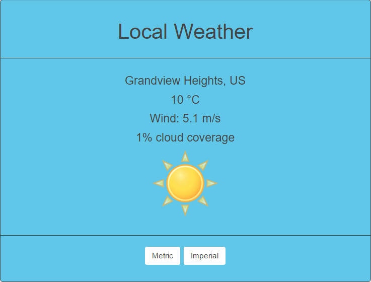
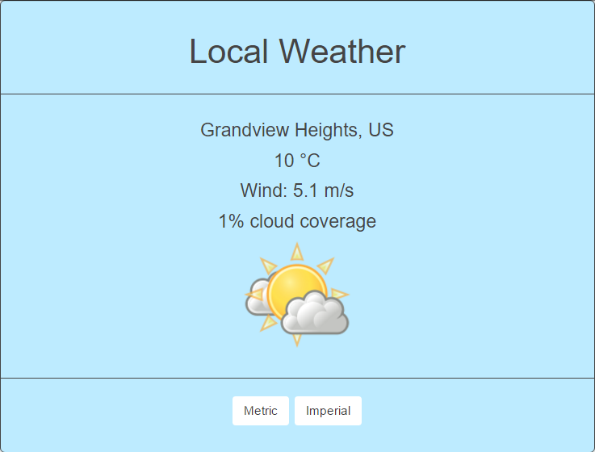
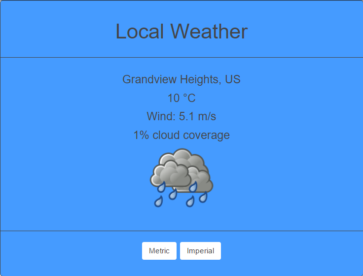
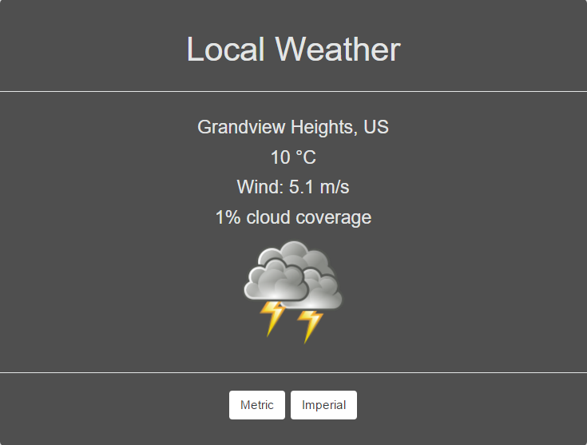
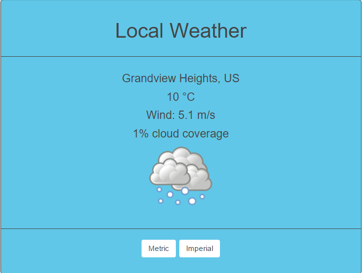

#Local Weather App:
Once the user allows the app to use their geographic location, the app will display the weather data. The weather icon will represent the current
weather. The user can also change between celcius and fahrenheit

#TODO:
1. Add a 'more info' button which will disply all of the weather data given in the json object.
2. Check to see whether its night or day and update app accordingly
3. 
## [Click here to check out the live app on Codepen.io](http://codepen.io/Jordan-McMillan101/full/grLmGz/)

#Screenshots:

