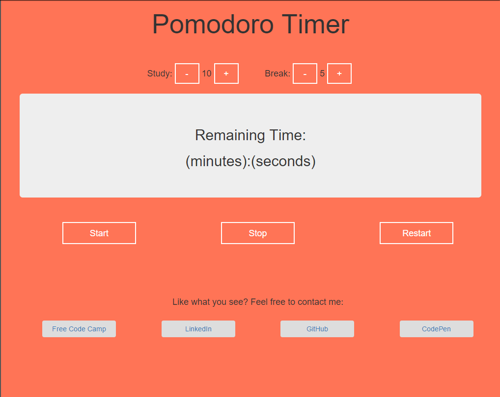

# Pomodoro Timer:
The idea of a Pomodoro timer is to set the timer to say, 25 minutes, and tell yourself "I'll just sit down and work for 25 min." Once you begin to work you'll eventually (and hopefully) be so deep into your work that you'll forget you even set a timer. If you remember you set your timer then once the 25 min is up you can reward yourself with a short 5 or 10 minute break. Rinse and repeat for as many rounds as you feel necessary.

Personally, I love using this method to lead myself through a very productive day. I'm a visual person, so being able to look at and keep track of the amount of time that I've spent being productive makes me feel good about my accomplishments. :)

## [Click here to check out the live app on Codepen.io](http://codepen.io/Jordan-McMillan101/pen/gPjpvr)

## How to Use:
1. Set the length of both the study session and then the break session
2. Click the start button when ready to start the timer
3. The stop button is there in case you need to stop the timer for whatever reason that may be
3. The reset button is there to start the study and break sessions to their initial times

## ToDo:

1. Add a checkbox feature so the user can choose whether they wish to be alerted or not.
2. Add another check box if they wish for the alert to have a sound or not
3. Add a feature which will keep a track record of their previous study/break sessions so they can look back at the amount of sessions they've completed and get that sense of accomplishment.

#Screenshot:

