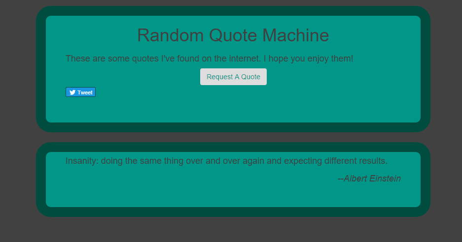

# Quote Machine:

Upon clicking the "Request A Quote" button, the app will print a new and inspirational quote. If you come across a quote you 
like you can click the twitter button and tweet the quote.  :)

## ToDO:

1.) fix the twitter button so it displays the current quote. (right the default tweet is just a link to the app, oops)
2.) add more kewl quotes
3.) change the initial quote box so it doesn't appear until the first quote appears

# Screenshot:

